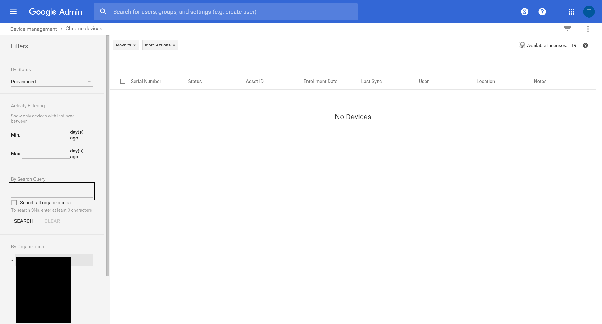

# Omnibar
Shares its name with the big bar in Chrome.

It allows you to search for a **single** device. Use the *import* menu (Alt+I) to select more than one device.

## Searching the Omnibar
- [Device ID](#device-id)
- [Asset ID](#asset-id)
- [Query String](#query-string)
- [Serial Number](#serial-number)
- [Email](#email)

### Device ID
A Device ID is a 36-37 character string unique to every managed chrome device, normally hidden from the user. Enter one and press submit to use it.

You can find Device IDs from a GAM spreadsheet or by selecting a device using another method and clicking "Copy device ID"

The Omnibar will decide your input is a *device ID* by using a regex.
### Asset ID
Asset IDs are set from the admin console or during enrollment. Enter one to search by it.

The Omnibar will decide your input is an *asset ID* by **first, checking if your preferences are set to search for asset ID or serial number first. Then, it will do a search for that string as a serial number, then if it finds nothing, will search for it as an asset ID. (that order will change depending on the preference)**.
### Query String
The most powerful and most difficult method. These are used in the small search field in the Google Admin Console:

#### Please use [this](https://support.google.com/chrome/a/answer/1698333#search) link for detailed instructions!

Some examples include:
| Query String | Explanation |
| :------------- | :------------- |
| user:jsmith | Devices owned by the user `jsmith`. |
| location: seattle | Devices with the location `seattle`. |
| user:jsmith status:deprovisioned | Devices owned by the user `jsmith` that are deprovisioned.

The Omnibar will decide your input is a *query string* by **checking for a colon (:) in it**.
### Serial Number
The serial number of a device. Normally printed on the device. **Partial serial number searches are supported, provided you have three or more characters.**

The Omnibar will decide your input is an *serial number* by **first, checking if your preferences are set to search for asset ID or serial number first. Then, it will do a search for that string as a serial number, then if it finds nothing, will search for it as an asset ID. (that order will change depending on the preference)**.
